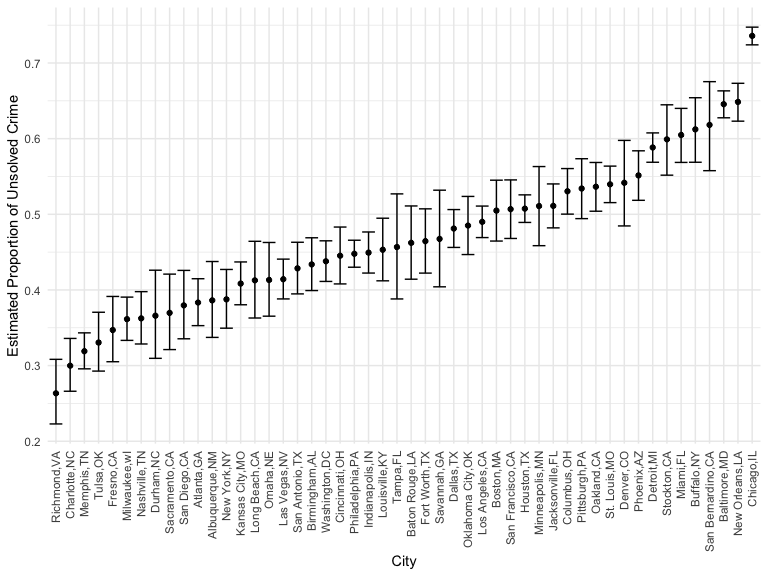
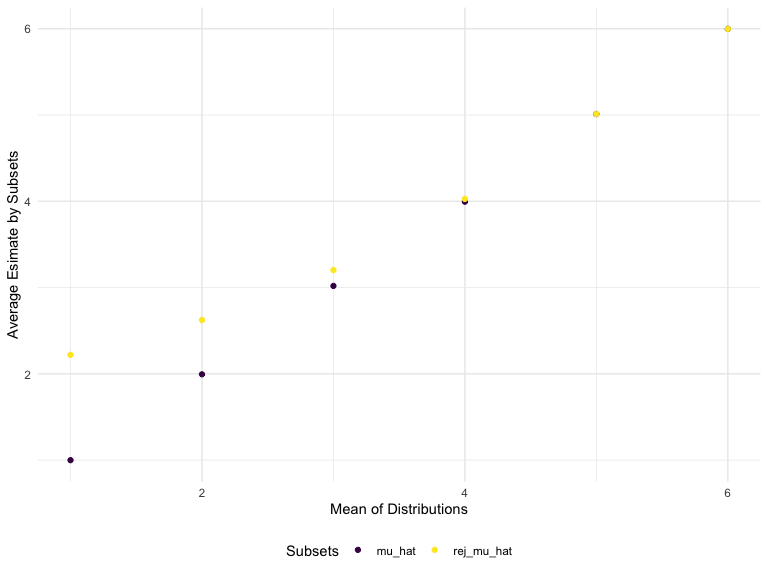

P8105_hw5_yj2752
================
Yixuan Jiao

## Import pacakges

``` r
library(purrr)
library(tidyverse)
set.seed(42)
```

## Problem1

Reading all csv merge them into a single file

``` r
exp_table <- 
  tibble(id = list.files("./data/p1")) %>%
  mutate(file_dir = str_c("./data/p1/",id)) %>%
  mutate(data = map(file_dir, read_csv)) %>%
  unnest(data)
```

Tidy the table

``` r
exp_table_tidy <- 
  exp_table %>%
  select(-file_dir) %>%
  mutate(id = str_replace(id,".csv","")) %>%
  separate(id,into = c("group","id"), sep = "_") %>%
  pivot_longer(week_1:week_8,names_to = "week", names_prefix = "week_",values_to = "data")
head(exp_table_tidy)
```

    ## # A tibble: 6 × 4
    ##   group id    week   data
    ##   <chr> <chr> <chr> <dbl>
    ## 1 con   01    1      0.2 
    ## 2 con   01    2     -1.31
    ## 3 con   01    3      0.66
    ## 4 con   01    4      1.96
    ## 5 con   01    5      0.23
    ## 6 con   01    6      1.09

## Problem2

The data is loaded using `read_csv()`.

``` r
homicide <- read_csv("./data/homicide-data.csv")
```

    ## Rows: 52179 Columns: 12
    ## ── Column specification ────────────────────────────────────────────────────────
    ## Delimiter: ","
    ## chr (9): uid, victim_last, victim_first, victim_race, victim_age, victim_sex...
    ## dbl (3): reported_date, lat, lon
    ## 
    ## ℹ Use `spec()` to retrieve the full column specification for this data.
    ## ℹ Specify the column types or set `show_col_types = FALSE` to quiet this message.

The raw data contain the victim’s basic information(name,race,age,sex),
and location and status of the case. Detail descriptive data is
generated by `skimr::skim()` below.

``` r
skimr::skim(homicide)
```

|                                                  |          |
|:-------------------------------------------------|:---------|
| Name                                             | homicide |
| Number of rows                                   | 52179    |
| Number of columns                                | 12       |
| \_\_\_\_\_\_\_\_\_\_\_\_\_\_\_\_\_\_\_\_\_\_\_   |          |
| Column type frequency:                           |          |
| character                                        | 9        |
| numeric                                          | 3        |
| \_\_\_\_\_\_\_\_\_\_\_\_\_\_\_\_\_\_\_\_\_\_\_\_ |          |
| Group variables                                  | None     |

Data summary

**Variable type: character**

| skim_variable | n_missing | complete_rate | min | max | empty | n_unique | whitespace |
|:--------------|----------:|--------------:|----:|----:|------:|---------:|-----------:|
| uid           |         0 |             1 |   9 |  10 |     0 |    52179 |          0 |
| victim_last   |         0 |             1 |   1 |  20 |     0 |    12687 |          0 |
| victim_first  |         0 |             1 |   1 |  28 |     0 |    16640 |          0 |
| victim_race   |         0 |             1 |   5 |   8 |     0 |        6 |          0 |
| victim_age    |         0 |             1 |   1 |   7 |     0 |      102 |          0 |
| victim_sex    |         0 |             1 |   4 |   7 |     0 |        3 |          0 |
| city          |         0 |             1 |   5 |  14 |     0 |       50 |          0 |
| state         |         0 |             1 |   2 |   2 |     0 |       28 |          0 |
| disposition   |         0 |             1 |  14 |  21 |     0 |        3 |          0 |

**Variable type: numeric**

| skim_variable | n_missing | complete_rate |        mean |         sd |          p0 |         p25 |         p50 |         p75 |          p100 | hist  |
|:--------------|----------:|--------------:|------------:|-----------:|------------:|------------:|------------:|------------:|--------------:|:------|
| reported_date |         0 |             1 | 20130899.16 | 1123419.63 | 20070101.00 | 20100318.00 | 20121216.00 | 20150911.00 | 201511105\.00 | ▇▁▁▁▁ |
| lat           |        60 |             1 |       37.03 |       4.35 |       25.73 |       33.77 |       38.52 |       40.03 |         45.05 | ▁▅▅▇▅ |
| lon           |        60 |             1 |      -91.47 |      13.75 |     -122.51 |      -96.00 |      -87.71 |      -81.76 |        -71.01 | ▃▁▃▇▅ |

Adding `city_state` column, and correct a potential input error.

``` r
homicide <- 
  homicide %>%
  mutate(city_state = str_c(city,",",state)) %>%
  mutate(city_state = replace(city_state,city_state == "Tulsa,AL","Tulsa,OK"))
```

Generate the table of number of unsolved cases by cities

``` r
unsolved <-
  homicide %>%
  filter(disposition != "Closed by arrest") %>%
  group_by(city_state) %>%
  summarise(unsolved = n())
```

Generate the table of number of total cases by cities then bind two
tables together.

``` r
total <-
  homicide %>%
    group_by(city_state) %>%
    summarise(total = n())

cases_prop <- 
  full_join(total,unsolved)
```

    ## Joining, by = "city_state"

Use `prop.test()` to estimate the proportion of unsolved cases and its
confidence interval for Baltimor,MD. Use select to only pull out the
estimate and confidence interval

``` r
baltimore_prop <- prop.test(1825,2827)
broom::tidy(baltimore_prop) %>%
  select(estimate,conf.low,conf.high)
```

    ## # A tibble: 1 × 3
    ##   estimate conf.low conf.high
    ##      <dbl>    <dbl>     <dbl>
    ## 1    0.646    0.628     0.663

Now apply `porp.test()` to every cities in the table, then pull out the
estimate and confidence interval by `map2()` and `map()` function, then
unnest the tibble and select the desired column.

``` r
cases_prop <- 
  cases_prop %>%
  mutate(prop_test = map2(.x = unsolved, .y = total, ~prop.test(x = .x, n = .y))) %>%
  mutate(prop_test = map(prop_test,broom::tidy)) %>%
  unnest(prop_test) %>%
  select(city_state,estimate,conf.low,conf.high)
```

Reorder the cities by the value of estimate proportion then generate the
point plot with error bar, presenting the estimate proportion of
unsolved homicide cases of each state.

``` r
cases_prop %>%
  mutate(city_state = fct_reorder(city_state,estimate)) %>%
  ggplot(aes(x = city_state, y = estimate)) +
  geom_point() +
  geom_errorbar(aes(ymin = conf.low, ymax = conf.high)) +
  labs(x = "City",
       y = "Estimated Proportion of Unsolved Crime") +
  theme(axis.text.x = element_text(angle = 90, vjust = 0.5, hjust=1))
```

<!-- -->

## Problem3

Firstly, write a function for simulate normal distribution and generate
test statistics and p-value.

``` r
norm_sim <- function(mu, n = 30, sd = 5) {
  x <- rnorm(n,mean = mu, sd = sd)
  x %>%
    t.test(mu = 0) %>%
    broom::tidy() %>%
    select(estimate,p.value)
}
```

Apply function to $\mu = 0$ for 5000 times.

``` r
expand_grid(
  mu =0,
  iteration = 1:5000
) %>%
  mutate(sim_result = map(mu,norm_sim)) %>%
  unnest(sim_result) %>% 
  select(-iteration) %>%
  head()
```

    ## # A tibble: 6 × 3
    ##      mu estimate p.value
    ##   <dbl>    <dbl>   <dbl>
    ## 1     0   0.343    0.767
    ## 2     0  -0.610    0.530
    ## 3     0   0.954    0.193
    ## 4     0  -0.0942   0.921
    ## 5     0  -1.31     0.100
    ## 6     0  -0.0841   0.920

Iterate 5000 times for each of $\mu = \{1,2,3,4,5,6\}$

``` r
result_df <-
  expand_grid(
    mu = 1:6,
    iteration = 1:5000
  ) %>%
    mutate(sim_result = map(mu,norm_sim)) %>%
    unnest(sim_result) %>% 
    select(-iteration)
```

Use `summarise()` to get what we need for the plot ($\hat{\mu}$ and
proportion of null rejection).

``` r
df_rej <-
  result_df %>%
    filter(p.value < 0.05) %>%
    group_by(mu) %>%
    summarise(rej_mu_hat = mean(estimate),
              rej_prop = n()/5000)

df_all <-
  result_df %>%
  group_by(mu) %>%
    summarise(mu_hat = mean(estimate))

result_df <- full_join(df_all,df_rej)
```

    ## Joining, by = "mu"

As the effect size gets larger, the power (proportion of rejection) is
getting larger. Since the distributions generated

``` r
result_df %>%
  ggplot(aes(x = mu,y = rej_prop)) +
  geom_point() +
  geom_smooth(se = FALSE) +
  labs(x = "Mean of Distributions",y = "Proportion of Rejection (Power)")
```

    ## `geom_smooth()` using method = 'loess' and formula 'y ~ x'

<!-- -->
Since the datasets are generated by a true mean and given n and sigma,
the average $\hat{\mu}$ of total 5000 simulated datasets would always
close to its true mean, but as the true mean is small (or closed to 0),
part of $\hat{\mu}$ would fail to be rejected since it closes to 0. Then
the average $\hat{\mu}$ of rejection part would be higher than its true
mean. As the true mean gets larger, the proportion of rejection is very
large since most of the $\hat{\mu}$ would be different from 0. So the
average $\hat{\mu}$ of null rejected subsets would more and more closer
and eventually approximately equal to the simulated and true mean.

``` r
result_df %>%
  pivot_longer(mu_hat:rej_mu_hat, 
               names_to = "sample_means",
               values_to = "average_estimate") %>%
  ggplot(aes(x = mu,y = average_estimate, color = sample_means)) +
  geom_point() +
  labs(x = "Mean of Distributions",
       y = "Average Esimate by Subsets",
       color = "Subsets")
```

<!-- -->
